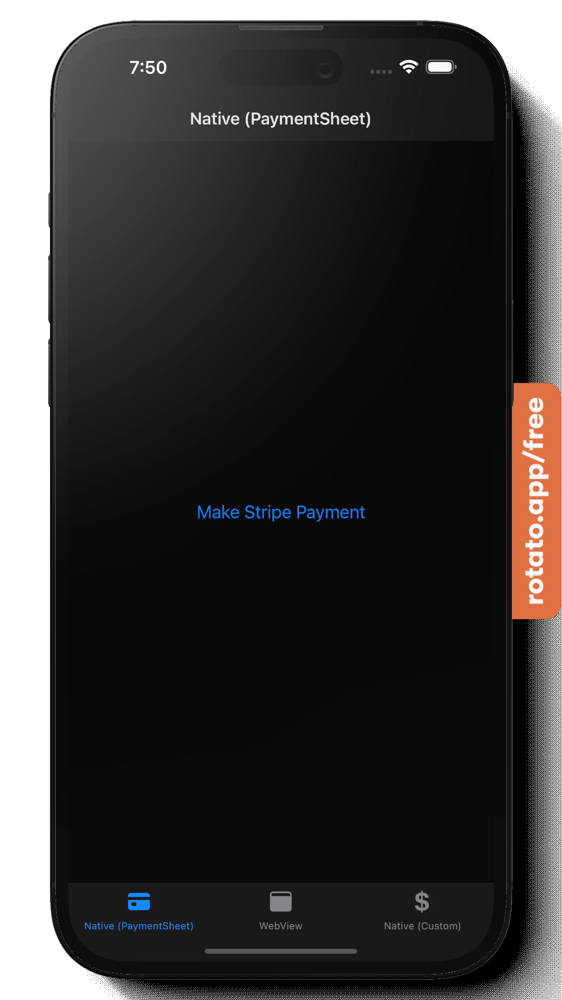
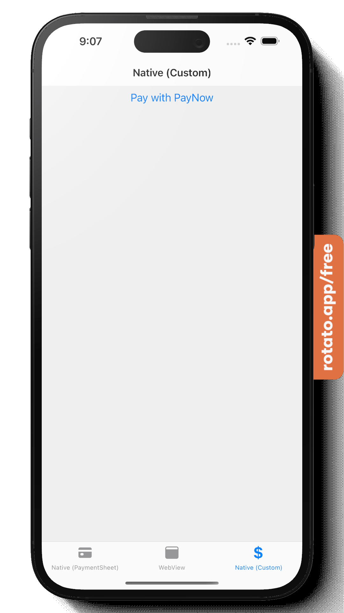

# Example of using the Stripe Payments API in a React Native Expo app

<p float="left" align="middle">



</p>

<p float="left" align="middle">


</p>

Screenshots were made using Rotato (https://rotato.app/).

The screenshots show the React Native app which can be found in the ./client folder. The app relies on the ./server NodeJs express API for the Stripe payment services.

The app shows 3 tabs:

1. Native (PaymentSheet): example of how to use the React Native Stripe PaymentSheet component. It only seems to work for card payments. Payment methods like PayNow and GrabPay don't show up even after creating a PaymentIntent that specifies them. See the "React Native PaymentSheet issues" section for more detais.

2. WebView: example of how to use the Stripe Payment Link feature using a React Native WebView. This works fine with all supported payment methods. Using the Payment Link feature does mean setting up Products and Product Prices beforehand, although this can be done using the Stripe API as well. For 2-way communication between the React Native app and the WebView see here: https://www.educative.io/answers/how-to-communicate-with-data-between-webviews-in-react-native.

3. Native (Custom): example of how to use the PayNow payment method in React Native without using the embedded WebView. The "Pay with PayNow" button creates a confirmed Stripe PaymentIntent with a payment method of PayNow. A confirmed PayNow PaymentIntent contains a link to a PayNow QR code (a PNG image). We return this link to the client app and display it. Normally the user would then scan the QR code in their banking app, but when testing that's not possible. What does work is to scan the QR code with your camera. This opens a webpage hosted by Stripe where you can authorize or decline the payment for testing. To make this even faster for testing the client app also allows you to simulate "approving" or "declining" the PayNow payment using 2 buttons. Clicking either calls the Stripe API and Stripe will then send an event to our /webhook. The /webhook code sends status updates to our client app using Server Side Events (SSE). The client app listens to SSE by calling the /stripe-events/events endpoint.

4. Connected Accounts: example of how to use Stripe Connected Accounts. If you build a marketplace or platform you probably have customers that want to offer their services through your platform and they need to be paid. Letting all the money flow through you is not the best idea. Connected Accounts allows your customers to have their own Stripe account and get paid through Stripe. Because their account is linked to your own account you can process transactions on their behalf and check the status of payments. This allows for some pretty sophisticated workflows. In this example customers can do the Stripe onboarding in the app itself using the InApp browser. For security reasons we use the InApp browser instead of the embedded WebView this time. Note that in Singapore SingPass is part of the onnboarding flow and it won't even work if you try to use the embedded WebView. The Stripe API allows you to create a Customer and prefill some of the data so your customers have less to fill in during onboarding. To allow customers to get started with the onboarding we first create an AccountLink using the Stripe API. The AccountLink object that is returned has a url property and we can simply show the url in the InApp browser to let the customer finish the onboarding. Detecting in our app when the user finishes onboarding is a bit complicated. When creating the AccountLink we can tell Stripe the returnUrl to use after the onboarding finishes. Stripe does not allow the returnUrl to be a custom scheme (fi exp://192.168.18.4:19000). We work around this by specifying a serverside returnUrl of http://{host or ip}/account-created (see ./server/routes/account.js). When this webpage loads in the InApp browser it redirects to our local app url which is passed as a querystring parameter in the returnUrl we registered with Stripe when we created the AccountLink. In the app we use expo-linking package to listen for changes in the app url. When the querystring in that local url contains account-created we dismiss (close) the InApp browser. This example also show how to now make a PayNow payment on behalf of a customer by clicking the "Pay" button behind a customer. The Stripe API allows us to make API calls on behalf of nother customer as long as they are linked to our account. When making API calls we add a custom request header (Stripe-Account) that specifies the accountId on behalf of whom we make the request. When using the Stripe NodeJs package the docs mention that we can use the "on_behalf_of" to achieve the same, but it did not work for me. The payments still under my own account and not under the connected account.

# Stripe terminology

PaymentIntent: A PaymentIntent is an object that specifies the intent of paying a certain amount with the choice of one or more payment methods. Normally the user would select which payment method to use.

Confirmed PaymentIntent: A confirmed PaymentIntent means a payment method is chosen from the list of available payment methods for the PaymentIntent. When creating a PaymentIntent using the Stripe API it is possible to immediately choose the selected payment method when creating the PaymentIntent (i.e we create a confirmed PaymentIntent immediately).

Webhook: The way in which Stripe can inform our server about interesting payment events. For local testing we can use the Stripe CLI and the Stripe dashboard also allows use to set up webhooks.

# Running locally

Stripe requires that you create your own backend server (API) to securely communicate with their API. In this example the custom backend server (API) is implemented in NodeJs and can be found in the ./server folder.

To run this demo, you must first sign up with Stripe and get your Publishable key and Secret key.

## Run the server

Copy the .env.example file:

```bash
cp ./server/.env.example ./server/.env
```

Update the .env file:

```
STRIPE_SECRET_KEY={your secret key in the Stripe dashboard}
STRIPE_PUBLIC_KEY={your public key in the Stripe dashboard}
MECHANT_ID={your merchant id (see Settings -> Account details in the Stripe dashboard. It starts with acct_)}
```

In one terminal window start the server:

```bash
npm run dev
```

In another terminal window start forwarding Stripe events to your /webhook:

```bash
stripe listen --forward-to localhost:4242/stripe-events/webhook
```

## Run the client

Copy the .env_local.example file:

```bash
cp ./client/.env_local.example ./client/.env_local
```

Update the .env_local file:

```
STRIPE_PUBLIC_KEY={your Publishable key}
```

Start the client:

```bash
npm start
```

## Running on a real device

If you want to run on your real (iOS) device and want to access the ./server Payment API running on your local machine you can update your shell startup config file (~/.zshrc in my case) and export your machine's network interface ip with. I do it like this:

```bash
export LOCAL_IP=$(ipconfig getifaddr en0)
```

The babel.config.js file already has LOCAL_IP in the allowed list of the react-native-dotenv plugin so it is available in the app:

```
allowlist: [ .., "LOCAL_IP"],
```

## Issues with running on a real device

If you test the "Native Custom" PayNow flow on a real device and use the same device to scan the QR code there is a tricky issue. To scan the QR code you have to move the client app to the background and that closes the SSE connection. The console will say something like "Connection error: The network connection was lost.". The /webhook event that Stripe sends still reaches our server API, but the SSE that updates the client app of the status change never arrives. Our current architecture is flawed and we cannot fix this easily.

One way of fixing this in our current architecture would be to store /webhook events that our server API receives somewhere. It could be in memory or by using a distributed cache like Redis. Our server API then keeps track of messages that have not been sent yet to our clients. When a client (re)connects it receives all the messages it never received before. A better implement of this means we have to write our own message bus which is complicated code to write.

An easier (and better) way to solve this issue, is by using a real-time db like the firebase real-time db and subscribe to changes. Firebase Cloud Messaging (https://rnfirebase.io/messaging/usage) would also work well and other vendors will offer similar services.

## Testing Stripe webhooks

Stripe uses webhooks to inform you about events such as when a PaymentIntent succeeded or failed. You can either use the Stripe CLI to test your webhooks locally or use a tool like ngrok to expose your localhost:4242/stripe-events/webhook endpoint on the internet.

To test using the Stripe CLI:

```bash
stripe listen --forward-to localhost:4242/stripe-events/webhook
```

Then in another terminal:

```bash
stripe trigger payment_intent.succeeded
```

More info here: https://dashboard.stripe.com/test/webhooks/create?endpoint_location=local

## Using ngrok

As an alternative to using the Stripe CLI forwarding you can expose the localhost:4242 API publicly (on the internet) using a tool like ngrok. See: https://ngrok.com/docs/getting-started/.

When using ngrok you can use the Stripe Dashboard to configure the publicly exposed /webhook provided by ngrok.

After installing and configuring ngrok start it:

```bash
ngrok http 4242
```

The console then shows something like this:

```bash
Forwarding https://a339-2406-3003-206b-7d-80fd-2187-fd06-90a5.ngrok-free.app -> http://localhost:4242
```

Now you create a webhook on the Stripe dashboard (https://dashboard.stripe.com/test/webhooks) by using the "Add endpoint" button. The Endpoint URL should be the public ngrok url with the path to the webhook. Here that would be:

```bash
https://a339-2406-3003-206b-7d-80fd-2187-fd06-90a5.ngrok-free.app/stripe-events/webhook
```

Under "Select events" select all PaymentIntent events.

After creating the webhook note that the Stripe dashboard shows a Signing secret (it starts with whsec\_). Update the ./server/.env file and set the STRIPE_WEBHOOK_SECRET to this Signing secret.

Remember that when you stop using ngrok and want to use the Stripe CLI for testing again you have to set STRIPE_WEBHOOK_SECRET back to the fixed test Signing secret found in the /server/.env.example file.

After updating the ./server/.env file don't forget to restart the server. It will not restart automatically.

Also note that you have to update your Stripe webhook url when you restart ngrok!

## Testing using the Thunder Client VS code extension

The Thunder Client can be used to test http calls directly within VS code. It is installed as a VS code extensions and is as an alternative to using tools such as PostMan or curl. You can import the Thunder Client collection from ./docs/thunder-collection-stripe.json. In the "Stripe Payments" collection settings under Auth -> Basic set the username to your Stripe secret key (sk_xxx). Just make sure to not commit the Stripe secret key so it ends up on github.

## Testing Server Side Events (SSE) with curl

The Payment API in ./server sends Server Side Events (SSE) to connected http clients when it receives Stripe /webhook events.

To start listening for such SSE with curl:

```bash
curl -H Accept:text/event-stream http://localhost:4242/stripe-events/events
```

Note the response http header (Connection: "keep-alive"). This is what makes SSE possible.

## React Native PaymentSheet issues

The React Native PaymentSheet seems to only work for card payments at the moment. Other payment methods simply don't show up.

1. Supported Payment Types not showing up: although Payment Types such as GrapPay and PayNow show up when using the PaymentSheet in a regular React web app, they don't show up when using the React Native PaymentSheet.

2. Frequent Crashes: the Expo Go app frequently crashes when something is configured wrongly. I hope the app does not crash when running outside the Expo Go app. Code that looks ok and compiles can easily crash the Expo Go app without any error messages appearing in the console. For example calling Alert.alert(..) with only one argument or calling Alert.alert(.., ..) with 2 arguments, but not passing a string to the arguments.

3. Lack of documentation: when it comes to any payment methods besides (credit) cards there is not much documentation available.

## react-client

The react-client folder shows how to use the Stripe react components in a react web application. As you can see the PaymentElement works better. Unlike the React Native PaymentSheet is does show all available payment methods.

## Thoughts on the optimal Stripe payment flow in React Native mobile apps for PayNow

If we only want to offer PayNow as the payment option:

1. Have a "Top-up Credit" button in the UI
2. When the user clicks the button show a screen where the amount can be specified. Provide some standard amounts and some options to get discount if they buy more credit?
3. After choosing the amount, use stripe.paymentIntents.create({ ... }) in a NodeJs AWS Lambda function to create the PaymentIntent. When succesful, also create a firebase realtime db object under /users/{uuid}/top-ups that has a unique id, amount, and timestamp and the id of the Stripe PaymentIntent. It would be best if the PaymentIntent object returned by stripe.paymentIntents.create({ ... }) would include the PayNow QR code, but it does not at the moment. So we have to rely on a webhook to listen for the
4. In a NodeJs AWS Lambda function listen for the payment_intent.requires_action event. This also means configuring a webhook in the Stripe dashboard. In the webhook we get the PayNow QR code image from the event (from next_action.paynow_display_qr_code.image_url_png) and store it in the top-ups object in firebase
5. Subscribe to real-time firebase updates on the top-ups object. That means that as soon as the PayNowQRCodePng is stored in the realtime db our app will be notified and we can show the QR code image.
6. In the same NodeJs AWS Lambda function listen for the payment_intent.succeeded event. Update the status of the top-up in firebase to 'succeeded' with a timestamp. The app should subscribe to this change and display a message to the user. The top-up history should show the top-up status as 'succesful' and the new credit amount should appear.

Offering additional payment methods would be very similar. We basically just need to create a PaymentSheet similar to the one that Stripe offers. To support card payments we can use the CardField React Native component:

```javascript
import { CardField, useStripe } from "@stripe/stripe-react-native";
```

As an alternative for the firebase realtime updates we could configure the React Native app to listen to an alternative event bus. All cloud providers will have things on offer.

## Stripe (Web) Payment Flow

When using the (web) based payment flow the following events are generated by Stripe:

- calling stripe.paymentIntents.create({ ... }) generates one event: payment_link.created
- when the user clicks on a payment method 2 events are generated: payment_intent.created and payment_intent.requires_action (for PayNow at least). Interesting enough the payment_intent.requires_action for PayNow also contains the PayNow QR Code:

```json
"next_action": {
  "paynow_display_qr_code": {
    "data": "https://stripe.com/payment_methods/test_payment?payment_attempt=xxx",
    "hosted_instructions_url": "https://qr.stripe.com/xxx",
    "image_url_png": "https://qr.stripe.com/xxx.png",
    "image_url_svg": "https://qr.stripe.com/xxx.svg"
  },
  "type": "paynow_display_qr_code"
}
```

- when the user pays successfully 3 events are created: payment_intent.succeeded, charge.succeeded and checkout.session.async_payment_succeeded. Note: in the Stripe test environment there was a 20-minute delay before these events were visible in the UI.

- when payment fails 2 events are created: payment_intent.payment_failed and charge.failed. In this case the events were visible in the UI within 10 seconds.

- for testing the Stripe CLI is a very useful tool

## PayNow flow

In the Thunder Client "Stripe Payments" collection execute the "Create and confirm PaymentIntent" request and grab the payment\*attempt from the response (in this case payatt\_):

```json
"next_action": {
  "paynow_display_qr_code": {
    "data": "https://stripe.com/payment_methods/test_payment?payment_attempt=payatt_",
  },
  "type": "paynow_display_qr_code"
}
```

Then execute the "Succeed PaymentIntent" request after filling the external_transaction_id query parameter with the payment_attempt id.

## GrabPay flow

Refer to the "Create and confirm PaymentIntent (GrabPay)" Thunder Client request. If you execute it you will see in the response a next_action:

```json
"next_action": {
  "redirect_to_url": {
    "return_url": "http://localhost:3000",
    "url": "https://pm-redirects.stripe.com/authorize/acct_1NIOT8E0jVisloCu/pa_nonce_xxx"
  },
  "type": "redirect_to_url"
},
```

Doing a get on the url returns a redirect response (302) with the location header:

```bash
curl -s -o /dev/null -D - https://pm-redirects.stripe.com/authorize/acct_1NIOT8E0jVisloCu/pa_nonce_O5hkm97ZZkDoCRWqSySVo1Dpl3QfKMw
```

```bash
location: https://stripe.com/payment_methods/test_payment?payment_attempt=payatt_xxx&pa_nonce_xxx
```

Finally you can now set the PaymentIntent to succeeded with using the nonce:

```bash
curl "https://pm-redirects.stripe.com/return/acct_1NIOT8E0jVisloCu/pa_nonce_O5hozBomLNGAYncOqOWWWOPPiBtDR0o?code=foo&state=bar"
```

Approve it:

```bash
curl "https://pm-redirects.stripe.com/return/acct_1NIOT8E0jVisloCu/pa_nonce_O5hozBomLNGAYncOqOWWWOPPiBtDR0o?code=foo&state=bar"
```

Alternatively set it to failed with:

```bash
curl "https://pm-redirects.stripe.com/return/acct_1NIOT8E0jVisloCu/pa_nonce_O5hozBomLNGAYncOqOWWWOPPiBtDR0o?error=baz"
```

### Local testing with curl

Create the PaymentIntent:

```bash
curl -X POST http://localhost:4242/stripe-grab/payment-intents \
   -H 'Content-Type: application/json' \
   -d '{"amount": "900"}'
```

Approve it:

```bash
curl "http://localhost:4242/stripe-grab/payment-intents/pa_nonce_O5imDDkkF61DjRLzex7uuepMyXq4UfZ/approve"
```

Decline it:

```bash
curl "http://localhost:4242/stripe-grab/payment-intents/pa_nonce_O5imDDkkF61DjRLzex7uuepMyXq4UfZ/decline"
```

## Stripe Connected Accounts

The Linked Accounts feature is useful for platform tools and market places. It allows the platform to send payments directly to connected customers (Linked Accounts) and collect fees on each succeeded payment.

When creating a PaymentIntent for a Linked Account you pass the Merchant Id of the Linked Account in the request header:

```javascript
request.Headers.Add("Stripe-Account", "acct_xxx");
```

According to the Stripe API docs passing the on_behalf_of field in the request body should also be possible, but in my testing it did not work. The PaymentIntent did not end up under the Linked Account but under the main Merchant Account.

Note that when linking a Custom Account you need to configure the allowed payment methods for the Linked Account seperately. Stripe distinguishes between Regular, Express and Custom accounts. You can read more about the in the docs.

When you create a Stripe Account using the API there are country-specific requirements. You can prefill come of the required info to make it a bit easier for your customer. What is required per country can be found here:

https://stripe.com/docs/connect/required-verification-information#SG-full-company--card_payments|transfers

In Singapore the Singpass APIs can be used for eKYC (eKnow Your Customer). Flows in which user data is retrieved do not work in embedded webviews, so you should use in InApp browser instead. See: https://api.singpass.gov.sg/library/myinfo/developers/implementation-technical-requirements

## Stripe Docs

In the Stripe Dashboard under Developers -> Events you can see all events that were generated.
This include events for offline payments such as PayNow. When you click on an event you can see the details, including which webhooks were called and whether the calls were successful or not.

https://dashboard.stripe.com/test/events

Useful docs:

https://stripe.com/docs/webhooks
https://stripe.com/docs/api/events
https://stripe.com/docs/cli
https://stripe.com/docs/payment-links/customer-info

https://connect.stripe.com/express/oauth/authorize?redirect_uri=https://connect.stripe.com/hosted/oauth&client_id=ca_O6ix8kglPjdNBLgfITqc27sBqoT36yIr&state=onbrd_O6nyClxF1ZxEKT0guaw0Dxrq18&stripe_user[country]=SG
